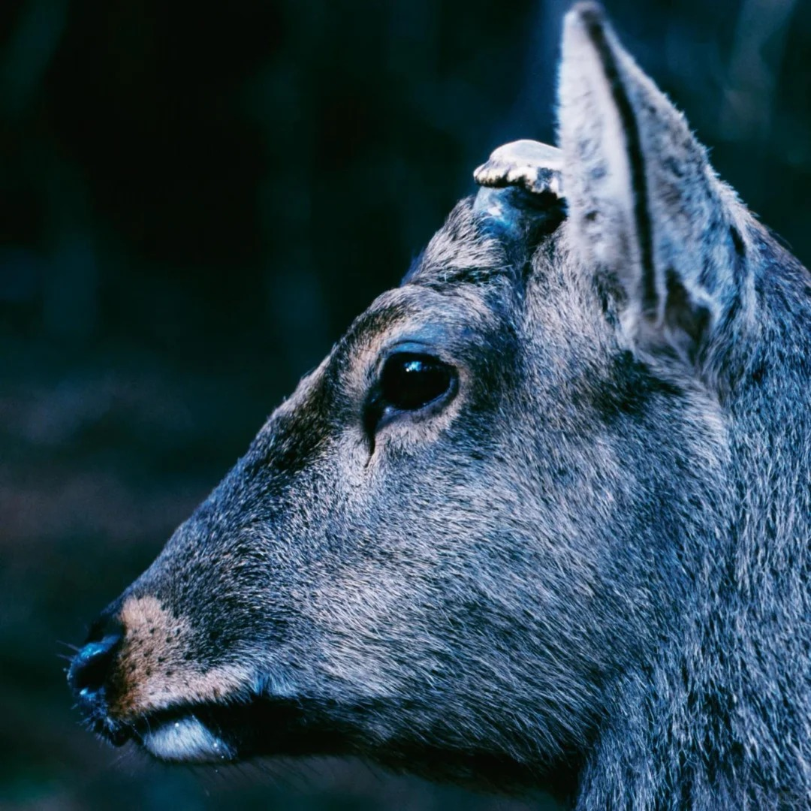
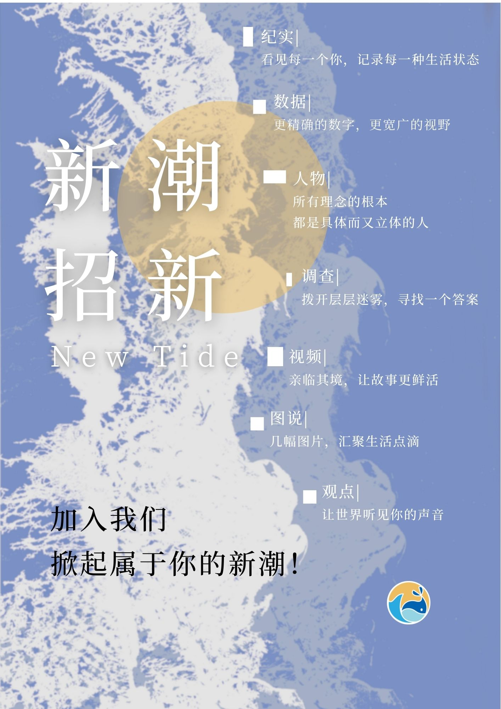

# 你好，我是 Luvency 👋

欢迎来到我的个人主页

## 🎓 教育背景
- **院校**：南京大学新闻传播学院
- **专业**：传播学

## 💡 特长与技能
- **专业技能**：illustrator 海报制图 视觉设计
- **其他特长**：摄影

## 🎨 兴趣爱好
- 爱好1，听音乐
- 爱好2，绘画
- 爱好3，羽毛球

- markdown
## 🎨 我的作品

这是我设计的一张海报：

  

## 📬 联系我
- GitHub: @Luvency(https://github.com/Luvency)
- 邮箱：502026110037@smail.nju.edu.cn
